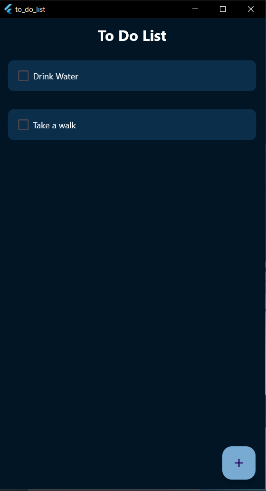
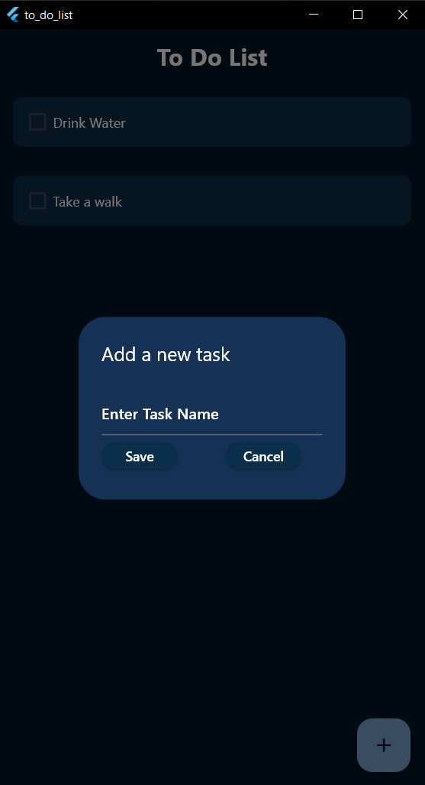
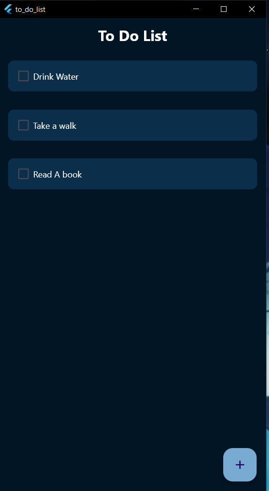
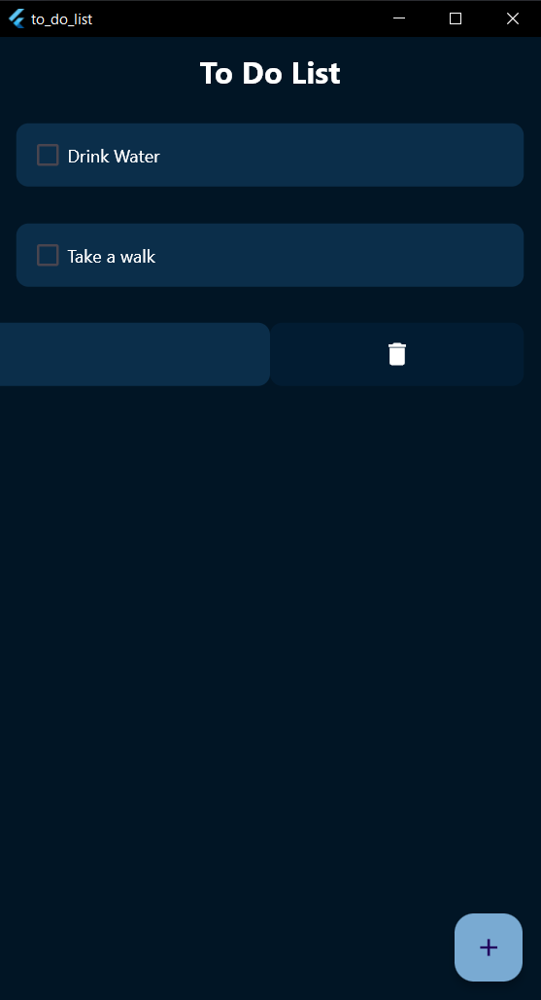
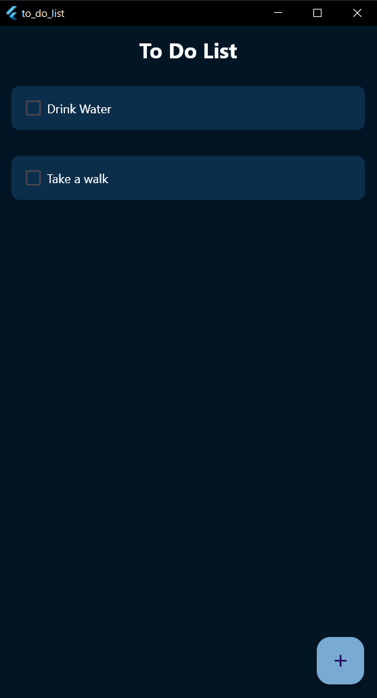
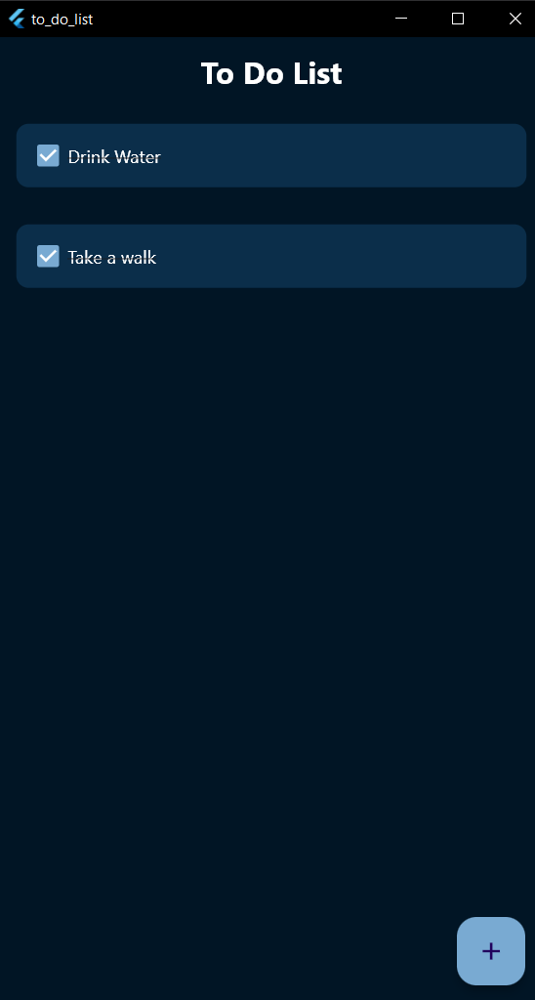

# to_do_list

My first simple application using Flutter

This is a simple to_do_list that enables one add and delete tasks as well as tick a  task added.

The completed task will be crossed off on completion

